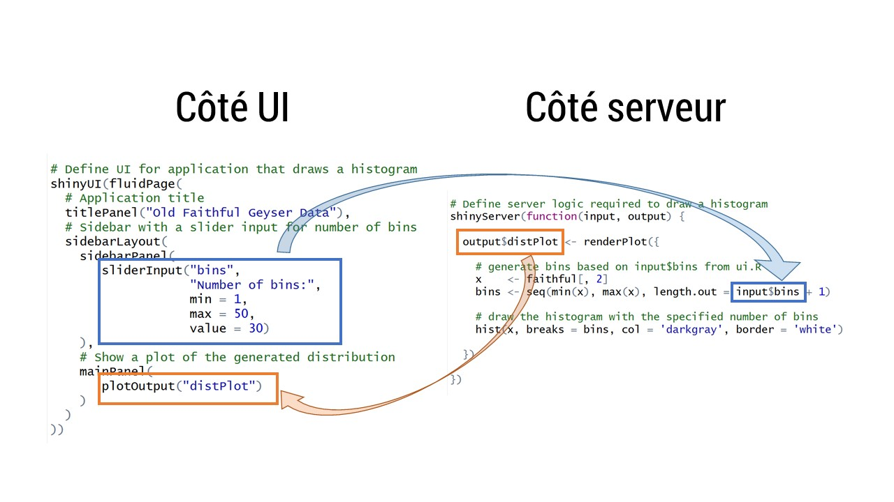

```{r knitr_init, echo=FALSE, cache=FALSE}
library(knitr)
library(rmdformats)

## Global options
options(max.print="75")
opts_chunk$set(echo=TRUE,
	             cache=TRUE,
               prompt=FALSE,
               tidy=TRUE,
               comment=NA,
               message=FALSE,
               warning=FALSE)
opts_knit$set(width=75)
```


# What is a Shiny app ? 


Shiny is a framework helping to build web applications for R

Why is it a full success (for R user at least) ?  

* easy to write : no web language skill is needed

* R scripts/functions/packages are easily mobilisable : it's super easy to transform an existing script to an app

* apps can be published using R but also like a web service using RShiny servers


# Examples of RShiny web app deployed on internet

<http://shiny.thinkr.fr:8080/>

# The principles of a Shiny web app 

An app contains 2 files : 

* ui.R stands for "user interface" : this file defines the appearance of the web page and the inputs

* server.R : this file defines how, on the R server side, how R should behave, what computations are expected. The server provides outputs to the user dépending on the user's behaviour.

Nota Bene : sometimes you'll find a unique `app.R` containing the UI and the server sides.  App is run with `shinyApp(ui,server)` function or by clicking on the "Run" button. 

# You're first Shiny app....

## ...from the outside

In RStudio, 

File > New File > Shiny Web App


* baptise your app

* choose multiple file to split UI and server into separates file

* choose a path where to save yout project


Once the project is created, click on "Run app" or run `runApp('app_name')`!


## ... from the inside : 



When choosing a "unique file", this is the template or a Shiny app : 

```{r, eval = FALSE}

library(shiny)

ui <- fluidPage()

server <- function(input, output) {}

shinyApp(ui = ui, server = server)
```


# Shiny functions: UI side 

2 types of functions : `xInput` et `xOutput`

These 2 families deal with: 

+ inputs the user will send to the server and

+ outputs the server will render 


## What inputs ? 

### a figure, a slider

a figure the user must enter : 

```{r}
numericInput(inputId = "Numeric", label = "Choose a figure between 0 and 100",
value = 50, min = 0, max = 100, step = 10)
```

or a slider : 

```{r}
sliderInput("slider", "Number:",
    min = 0, max = 1000, value = 500)
```

```{r}
sliderInput("slider", "Number :",
    min = 0, max = 1000, value = c(100,300))
```


### some text

```{r}
textInput(inputId = "text", label = "Enter some text", value = "example")
```


```{r}
textAreaInput(inputId = "text", label = "a bigger text box")
```

### a list

With a unique choice : 

```{r}
selectInput(inputId = "idSelect", label = "Choose: ",
            selected = 3,
            choices = c("choice 1" = 1, "choice 2" = 2, "choice 3" = 3))
```

With multiple choice : 

```{r}
selectInput(inputId = "idSelect", label = "Choose: ",
            selected = 3,
            multiple = TRUE,
            choices = c("choice 1" = 1, "choice 2" = 2, "choice 3" = 3))
```

### simple checkbox

```{r}
checkboxInput(inputId = "check1", label = "Check: ", value = TRUE)
```

### multiple checkbox

```{r}
checkboxGroupInput(inputId = "checkmultiple", label = "Check", choices = c("check 1", "check 2", "check 3", "check 4"),selected = "check 1",inline = TRUE)
```


### Dates

```{r}
dateInput(inputId = "ladate", label = "A date",
          value = Sys.Date()-10,
          format = "dd/mm/yy",
          language = "fr",
          startview = "year", 
          weekstart = 1)
```

or an interval : 

```{r}
dateRangeInput(inputId = "rangedate", label = "an interval of time : ", language = "fr")
```

### a file

```{r}
fileInput(inputId = "file_import", label = "File to import", multiple = FALSE, accept = c("text/csv",
          "text/comma-separated-values,text/plain",
          ".csv"))
```

### an action button

```{r}
actionButton(inputId = "idActionButton", label = "Click me")
```

FYI : 

```{r}
ls('package:shiny', pattern = "Input$")
```

## What outputs ? 

```{r}
htmlOutput(outputId = "htmlrender")
```

```{r}
imageOutput(outputId = "image")
```

```{r}
plotOutput(outputId = "graph")
```

```{r}
tableOutput(outputId = "table1")
```

```{r}
dataTableOutput(outputId ="table")
```

```{r}
textOutput(outputId = "text")
```

```{r}
verbatimTextOutput(outputId = "alongertext")
```


```{r}
uiOutput(outputId = "auielement")
```

FYI :

```{r}
ls('package:shiny', pattern = "Output$")
```

# Shiny functions: server side 

The R server assembles inputs in order to render them to the user via output functions
The art of Shiny is to put together the pieces on the server side in order to render what the user asks for on the UI side.  

There are 3 rules to remember: 


1. Objects to render in *Output functions on the UI side must be called using `output$x` on the server side:

Exemple : 
```{r, eval=FALSE}
ui <- fluidPage(
  plotOutput("aplot")
)

server <- function(input, output) {
  output$aplot <- # some R code 
}

shinyApp(ui = ui, server = server)
```

2. As long as a `output$x <-` instruction is present in the server side, it should be immediatly followed by a `render*()` function

Our example is now : 

```{r, eval = FALSE}
ui <- fluidPage(
  plotOutput(outputId = "aplot")
)

server <- function(input, output) {
  output$aplot <- renderPlot({# R code using plot() function
  })
}

shinyApp(ui = ui, server = server)
```

NB : Be careful to the curly brackets. Curly brackets receive R code.

A list of all the `render*()` functions inside Shiny 
```{r}
ls('package:shiny', pattern = "^render")
```

(If a "special" rendering is expected, you'll find the render functions in the package).


Render functions work *hand in hand* with `*Output()` functions from the UI. 

3. To call inputs from the UI inside the server in order to program the `render*()` functions the `input$x` function should be used: 


```{r, eval = FALSE}
ui <- fluidPage(
  # input is provided by a sliderInput() : 
  sliderInput(inputId = "bins", "Number of bins", min = 1, 
              max =50, value = 30),
  # the returned output is a plot called "aplot"
  plotOutput("aplot")
)

server <- function(input, output) {
  output$aplot <- renderPlot({ # aplot object is given to plotOutput via output$aplot
    
    # selection of the variable "waiting" in faithful dataset
    x    <- faithful[, 2]
    
    #  number of bins given in input
    bins <- seq(min(x), max(x), length.out = input$bins + 1)
    
    # building the plot
    hist(x, breaks = bins, col = 'darkgray', border = 'white', 
         main = "Histogram of waiting time before 2 eruptions")
  })
}

shinyApp(ui = ui, server = server)
```

Be careful : Please separate arguments in the `fluidPage()` function on the UI side with commas


Exercise 1 :

Add a text box below the graph informing us about the mean time to wait before 2 eruptions


# About reactivity functions on the server side

`render*()` functions have immediate reactivity. That is to say, for each couple input\$inputId <-> output\$outputId the update is instantaneous as soon as input\$inputId changes value.

Reactive values go **hand in hand** with reactive functions.

As soon as the input changes, reactive values are going to influence the functions that use them to notify them that the parameters they are using are invalid. Every single chunk of R code that contains the output is evaluated: reactive functions update the `output$outputId`


## Rendering with `render*()`

Each time an input that is used in a `render*()` function changes, the whole chunk is (re)evaluated. 

Question : 

In the previous example, when does the mean calculation is done ? 

Exercise 2 : 

Duplicate the previous app. Add a text input that allows tue user to change the title of the plot (option `main=` in the `hist()` function)


Exercise 2a : 

Add another text input to paste to the first one in order to define the title of the plot.

## Modulate the use of functions with `reactive()`

`reactive()` functions aim at creating objects. The objects are reactive and linked to inputs that will be used in several places of the app. It's a mean to master and control the reactivity flow of the app. 

```{r, eval = FALSE}

a_variable_to_reuse <- reactive({expression involving inputs})
...
output$name_of_the_output <- render*({function1( param = a_variable_to_reuse() )})

output$name_of_another_output <- render*({function2( param = a_variable_to_reuse() )})
```


**Be careful** : Please, pay attention to the newly created reactive function. Like every R function, it is equiped with brackets: `a_variable_to_reuse()`. When you need to use it, make sure to use it with brackets. 

Remember that when a function is called without `()`, the console returns the source code of the function (and that might not be the expected behavior) 

Exercise 3 : 

Duplicate exercice 2a, add a text input below the graph that counts the number of characters of the plot title. Please wrap the inputs `reactive()`function to simplify the code. 

## Play with time with `isolate()`

`isolate()` is a function that returns a non reactive value. 

Syntax is the same as `reactive*()` : 
```{r, eval = FALSE}
isolate({expression involving inputs})
```
With brackets because it's a function, and with curly brackets because it contains R code

When running the app for the first time, the default value of `isolate()` function, is the output of what's inside the curly brackets with the corresponding inputs. 

If inputs inside curly brackets change, the ouput is **not** updated.

But, and this is what is interesting in this function, if `isolate()` is inside a chunk containing reactive values, each time these values change, the whole chunk is evaluated and the expression inside `isolate()` is updated. 

`isolate()` is a mean to refresh "locally". The refresh is conditionned by environmental variables, reactive ones. 

Exercise 4 :

Make good use of `isolate()` to isolate reactivity of the plot title update: 
- number of character should be reactive BUT, 
- the plot title update should occur only when the slider is modified

## Trigger code with events: `observeEvent()` and `observe()`

These 2 functions behave the same way but have a different syntax

```{r, eval = FALSE}

observe({expression to evaluate, linked to an input})

observeEvent(input$event, {expression to evaluate, linked to input named event})

```


These 2 functions are waiting for interactions with the user. 

They are waiting for observations around inputs to trigger code inside curly brackets. 

It is possible to assign values to outputs having in mind that they will be (re)executed on-demand and not with a "local" refresh like reactive values inside  `render*()`:

```{r, eval = FALSE}
ui <- fluidPage(
  sliderInput(inputId = "num", 
    label = "Choose a figure",
    min = 1, max = 100, value = 25),
  actionButton(inputId = "go", 
    label = "Return the value of the action button in the console")
)

server <- function(input, output) {
  observeEvent(input$go, {
    print(as.numeric(input$num))
  })
}

shinyApp(ui = ui, server = server)
```

Events that trigger code elsewhere in the app are often `actionButton()` or...

## Play with time with `eventReactive()`

It is sometimes interesting to delay a flow of reactivity and updates on the UI and server side by giving the user the power to refresh himself rather than instantly, like `reactive()`. 
But it's also possible to condition the reactivity flow to an event: `eventReactive()`

Syntax is:  

```{r, eval=FALSE}
eventReactive(go input, {instructions to execute after the go})
```

Just like `reactive()`functions, `eventReactive()` functions returns a function. Consequently, brackets are needed each time you refer to it. 

```{r, eval = FALSE}

variable_to_reuse <- eventReactive(go input, {instructions to execute after the go involving inputs})
...
output$output_name <- render*({function1( param = variable_to_reuse() )})

output$another_output_name <- render*({function2( param = variable_to_reuse() )})
```


Exercise 5:

Starting from an empty template, create an app that uses an `actionButton()` to trigger some code that will `sample()` a number between 1 and 100.

Exercise 6:

Add to the `Old faithful` app an `actionButton()` to update the title and its number of characters as soon as the user clicks on it.  


## In a nutshell


A cheatsheet : 
<https://www.rstudio.com/wp-content/uploads/2015/08/shiny-french-cheatsheet.pdf>
<https://www.rstudio.org/links/shiny_cheat_sheet>
# How to customise the UI side ?

## by using everything you know about html 5 via `tags$`

`tags` are a list of functions to write html straight from R: 

```{r}
library(magrittr)
names(tags) %>% head(50)
```

thus...
```{r}
tags$blockquote("a quote")
```
...is a function that inserts the corresponding markups for blockquote

You can therefore add all the static elements of the UI using tags inside the `fluidPage()` function: 

```{r, eval = FALSE}
ui <- fluidPage(
  tags$h1("Title h1"), 
  tags$p(tags$code("I <3 R")), 
  tags$p(tags$code("I ",tags$strong("really"), "<3 R"))
)

server <- function(input, output) {
}

shinyApp(ui = ui, server = server)

```

## by recycling existing HTML

Using `HTML()` function !

```{r, eval= FALSE}
ui <- fluidPage(
HTML("<p>
  <code>
    I 
    <strong>really</strong>
    &lt;3 R
  </code>
</p>")
)

server <- function(input, output) {
}

shinyApp(ui = ui, server = server)
```

## by using build-in Shiny function 

Here is how to split the page with `div` : 
```{r}
fluidRow()
column(3)
```

```{r}
fluidRow("Line",
  column(3, "Column 1"), 
  column(3, "Column 2")
)
```

```{r, eval = FALSE}
ui <- fluidPage(
  fluidRow("Line",
           column(width = 3, "Column 1", 
                  sliderInput(inputId = "slider", label = "slider", 
                              min=1, max = 5, value = 2)), 
           column(width = 3, "Column 2",
                  sliderInput(inputId = "slider", label = "slider", 
                              min=1, max = 5, value = 2))
  )
)
  
  server <- function(input, output) {
  }
  
shinyApp(ui = ui, server = server)
```

or eventually using `*panel` functions : 
```{r}
ls('package:shiny', pattern = "Panel$")
```

The "usual" setup is `sidebarPanel()` coupled together with `mainPanel()`

```{r, eval = FALSE}
ui <- fluidPage(
  mainPanel(
    fluidRow("Line",wellPanel(
      column(width = 3, "Column 1", 
             sliderInput(inputId = "slider", label = "slider", 
                         min=1, max = 5, value = 2))), 
      column(width = 3, "Column 2",
             sliderInput(inputId = "slider", label = "slider", 
                         min=1, max = 5, value = 2))
    )
  )
)

server <- function(input, output) {
}

shinyApp(ui = ui, server = server)
```


## by using a dedicated folder for the UI design

From the moment you choose to customise the web page appearance, it is strongly advised to put all the needed materials in a dedicated root folder of the project.

This folder **must be** named `www` : 

```{r, eval = FALSE}
dir.create("www")
```


It's in this newly created folder that the web browser is going to dip into images or css template.

## by using a css template

...and making sure to drop it into `www`


